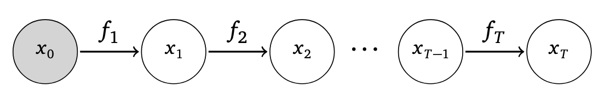
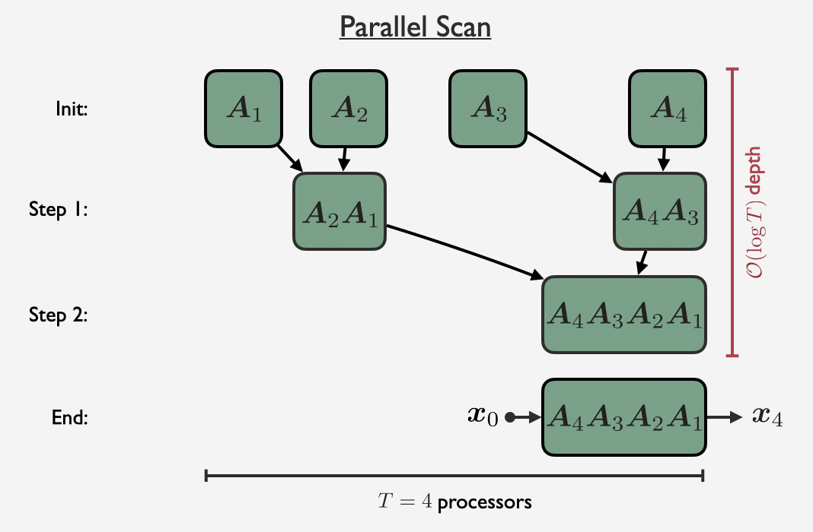

# A Unifying Framework for Parallelizing Sequential Models with Linear Dynamical Systems

**Check out an even simpler [quickstart-repo](https://github.com/lindermanlab/micro_deer/tree/main), including this [quickstart-notebook](https://github.com/lindermanlab/micro_deer/blob/main/nbs/demo.ipynb)**

This repository contains the code to accompany the paper "A Unifying Framework for Parallelizing Sequential Models with Linear Dynamical Systems." The primary contributions of our paper are unifying different fixed-point algorithms (Newton, quasi-Newton, Picard, and Jacobi) in the framework of linear dynamical systems (LDS), and demonstrating the effectiveness of these algorithms in parallelizing stateful (Markov) models.

We focus on parallelizing [state space models](https://probml.github.io/ssm-book/root.html), i.e. models of the form

```math
x_{t+1} = f_{t+1}(x_t),
```
where $f_t$ can be an *arbitrary* function. We omit input dependencies for simplicity, but note that an input $u_t$ can be incorporated into the definition of the transition function by letting $f_{t+1}(x_t) := f(x_t, u_t)$.

<div align="center">

</div>

In the context of parallelizing such state space models, we find that a wide variety of fixed-point methods have iterations that can be expressed as a linear dynamical system (LDS), i.e. with update given by:

```math
x_{t+1}^{(i+1)} = f_{t+1}(x_t^{(i)}) + A_{t+1} \, (x_t^{(i+1)} - x_t^{(i)}).
```

We summarize the fixed-point methods we consider in Table 1 of our paper.

<div align="center">

| Fixed-point method | Order             | Transition matrix $A_{t+1}$                                                                                   |
| ------------------ | ----------------- | ------------------------------------------------------------------------------------------------------------- |
| Newton             | first-order       | $\frac{\partial f_{t+1}}{\partial x_t}\left(x_t^{(i)}\right)$                                  |
| Quasi-Newton       | quasi first-order | $\text{diag}\left[\frac{\partial f_{t+1}}{\partial x_t}\left(x_t^{(i)}\right)\right]$ |
| Picard             | zeroth-order      | $I_D$                                                                                           |
| Jacobi             | zeroth-order      | $0$                                                                                             |

</div>

Each LDS can be parallelized over the sequence length with a [parallel scan.](https://docs.jax.dev/en/latest/_autosummary/jax.lax.associative_scan.html)

<div align="center">

</div>

## Installation Instructions

Info about how to install jax: https://docs.jax.dev/en/latest/installation.html

Use python 3.12.1

Use jax 0.5.2

### CPU

`pip install --upgrade "jax[cpu]==0.5.2"`

### GPU

`pip install --upgrade "jax[cuda12]==0.5.2" -f https://storage.googleapis.com/jax-releases/jax_cuda_releases.html`

### rest of the way

After installing jax appropriately based on hardware, simply run

`pip install -e .`

## Experiments

Our experiments are run using `experiments/harness.py` on an H100 with 80GB of VRAM.

## Citation

Please also star this repo if you find the code interesting or useful!

```
@article{UnifyingFramework2025,
  title={A Unifying Framework for Parallelizing Sequential Models with Linear Dynamical Systems},
  author={Xavier Gonzalez and E. Kelly Buchanan and Hyun Dong Lee and Jerry Weihong Liu and Ke Alexander Wang and David M. Zoltowski and Chris R\'e and Scott W. Linderman},
  year={2025},
}
```
